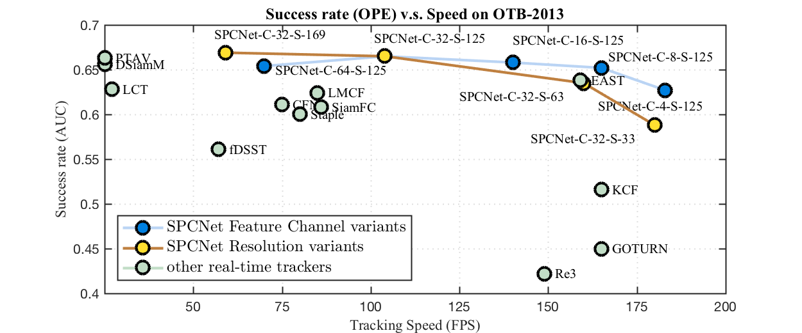
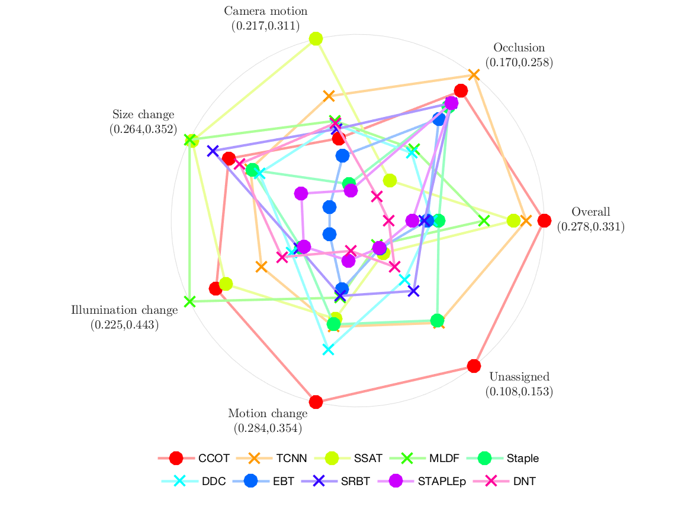
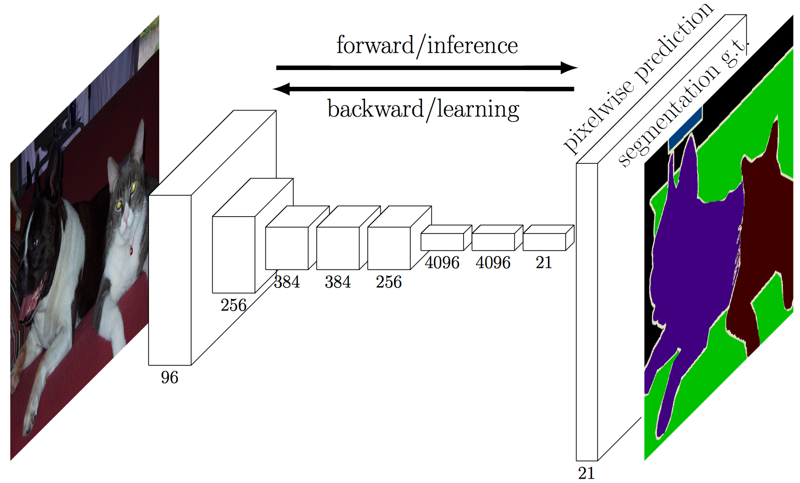
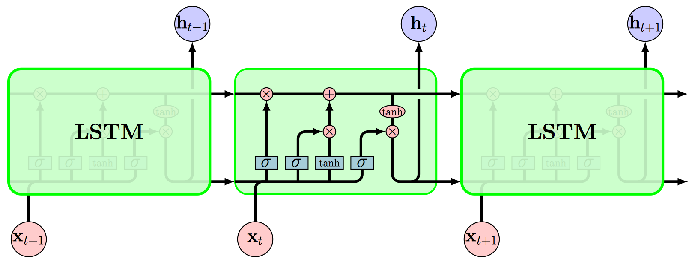
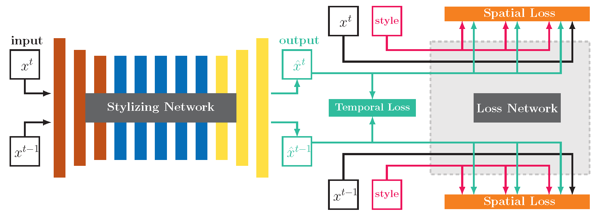
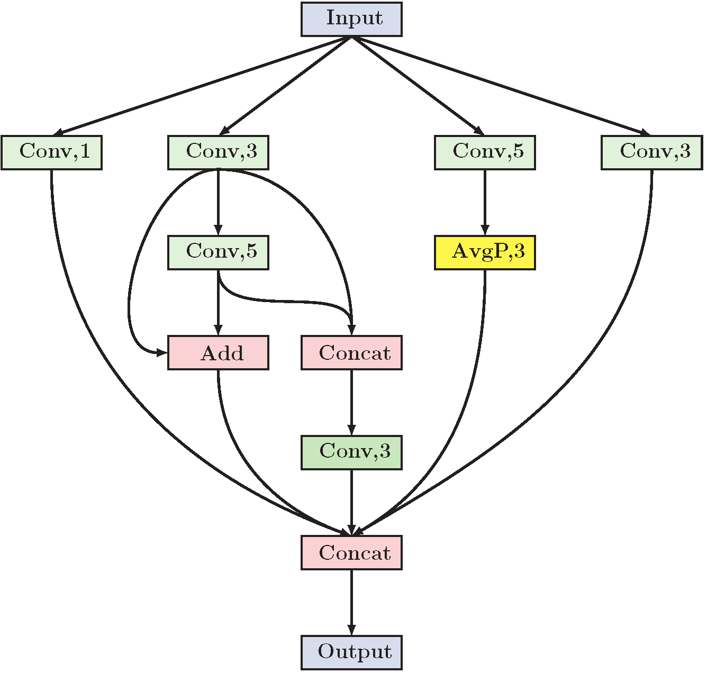

# VisualTracking-Toolkit

## Hyper-parameter Search (grid search)

### OTB

### VOT

## Visualization

### OTB

#### The tracking speed and AUC performance on OTB-2013. [[code]](code/speed_vs_auc_otb2013.m)

    

### VOT

#### Expected average overlap plot on VOT2016. [[code]](code/eao_rank_vot2016.m)

    

#### Expected averaged overlap performance on different visual attributes. [[code]](code/attr_eao_vot2016.m)

    

### Heatmaps

## Network

#### Fully Convolutional Networks for Semantic Segmentation [[code]](code/FCN/FCN.tex)

    

#### Understanding LSTM Networks [[code]](code/LSTM/LSTM.tex)

    

#### Real-Time Neural Style Transfer for Videos [[code]](code/StyleTransfer/StyleTransfer.tex)

    

#### BlockQNN [[code]](code/BlockQNN/BlockQNN.tex)

    

